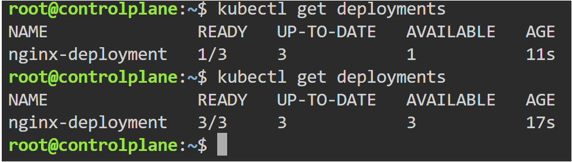
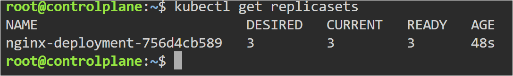
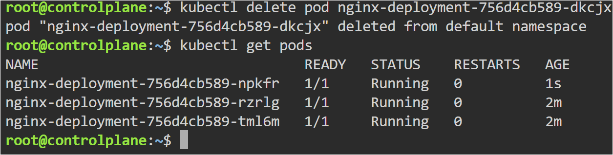
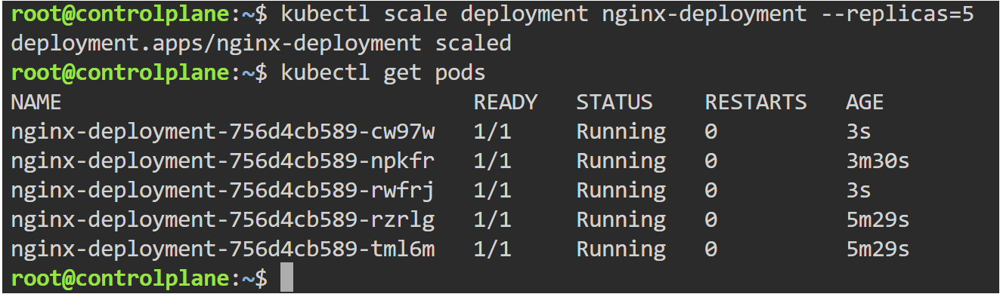
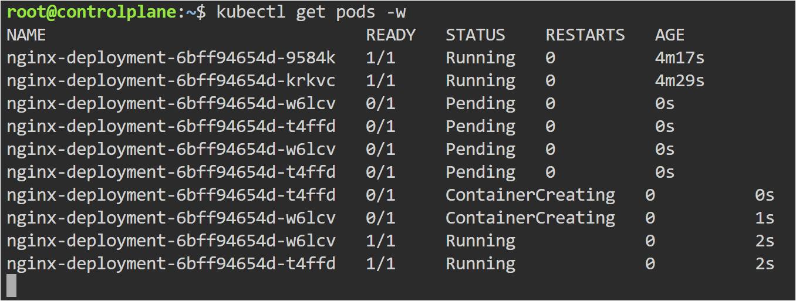
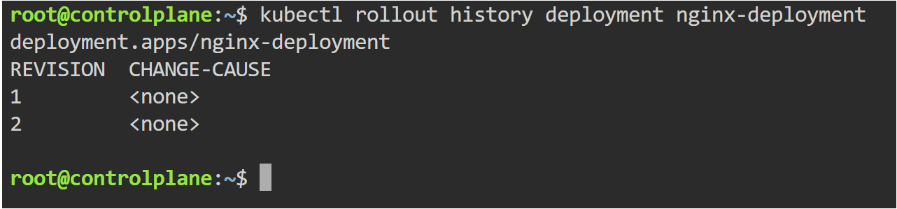
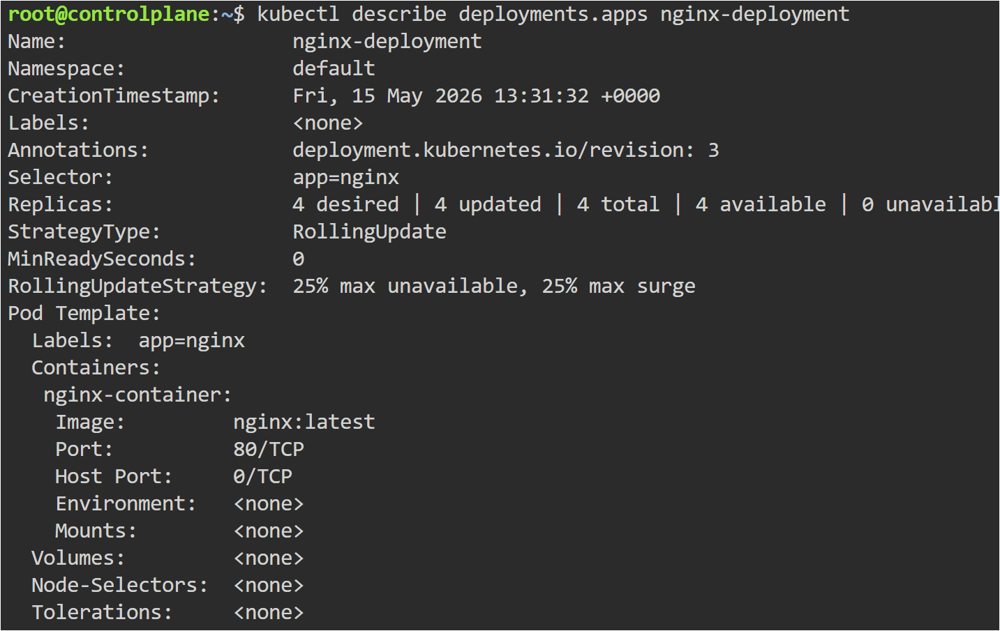

# Kubernetes Deployments

## Objective

Learn how Kubernetes Deployments manage Pods, scaling, self-healing, rolling updates, and rollback operations.

---

## Topics Covered

- Deployments
- ReplicaSets
- Scaling
- Self-Healing
- Rolling Updates
- Rollout History
- Rollback

---

## YAML File

- yaml/nginx-deployment.yaml

---

## Commands Used

```bash
kubectl apply -f nginx-deployment.yaml

kubectl get deployments

kubectl get replicasets

kubectl get pods

kubectl scale deployment nginx-deployment --replicas=5

kubectl set image deployment/nginx-deployment nginx-container=nginx:1.25

kubectl rollout status deployment/nginx-deployment

kubectl rollout history deployment/nginx-deployment

kubectl rollout undo deployment/nginx-deployment
```

---

# Deployment Running



---

# ReplicaSet Created



---

# Self-Healing Demonstration

A deleted Pod was automatically recreated by the Deployment controller to maintain the desired state.



---

# Scaling Deployment

Deployment scaled from 3 replicas to 5 replicas successfully.



---

# Rolling Update

Deployment image updated successfully using rolling updates without downtime.



---

# Rollout History

Deployment revision history maintained by Kubernetes.



---

# Rollback Success

Deployment successfully rolled back to previous stable version.



---

## Key Learning

- Deployments manage ReplicaSets and Pods automatically
- Kubernetes maintains desired state continuously
- Scaling adjusts application replicas dynamically
- Rolling updates provide zero-downtime deployments
- Rollbacks restore previous stable versions quickly
- Deployments provide self-healing capabilities

---

## Real-World Use

Deployments are widely used in production Kubernetes environments for managing application availability, updates, scaling, and recovery operations.
