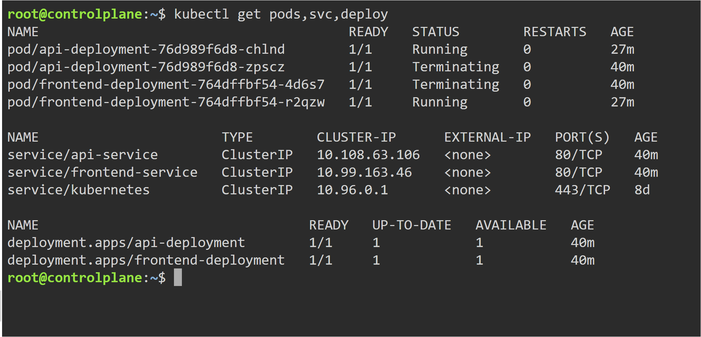
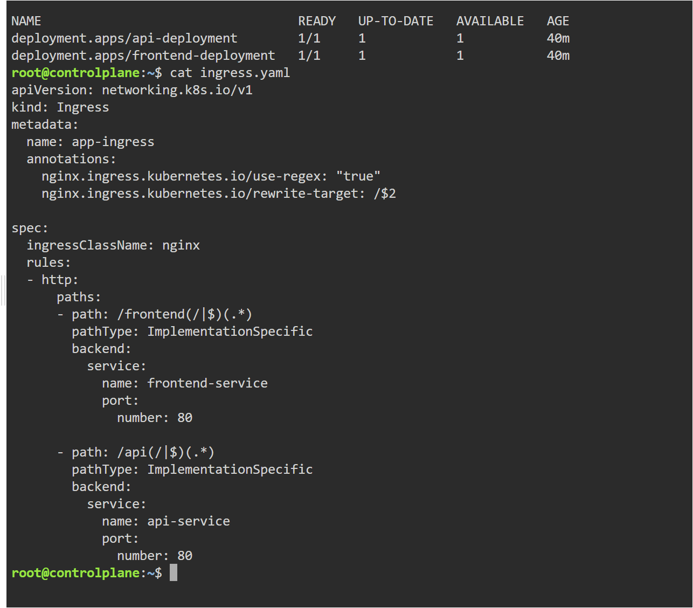
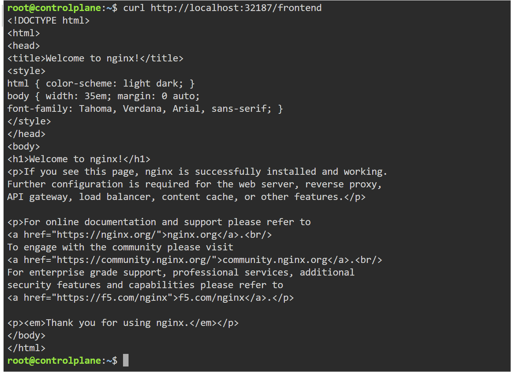
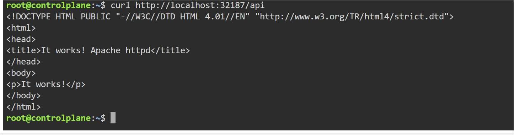

# Kubernetes Ingress

## Objective

Learn how Kubernetes Ingress provides a single entry point for external traffic and routes requests to different applications using path-based routing.

---

## Why Do We Need Ingress?

Before Ingress, applications are commonly exposed using NodePort Services.

Example:

```
Frontend  -> NodePort 30001
Backend   -> NodePort 30002
Admin     -> NodePort 30003
```

Managing multiple NodePorts becomes difficult as the number of applications grows.

Ingress solves this problem by exposing a single external endpoint and routing traffic based on rules.

Example:

```
/frontend  ---> Frontend Service
/api       ---> API Service
```

---

## When Should We Use Ingress?

Ingress is commonly used when:

- Hosting multiple applications on one domain
- Building microservices
- Performing path-based routing
- Performing host-based routing
- SSL/TLS termination
- Centralizing external traffic

In production environments, Ingress is one of the most commonly used networking resources.

---

## Architecture

```
Browser
   │
   ▼
Ingress Controller
   │
   ▼
Ingress Resource
   │
   ├───────────────┐
   ▼               ▼
Frontend Service   API Service
   │               │
   ▼               ▼
Frontend Pod       API Pod
```

---

## Topics Covered

- Ingress
- Ingress Controller
- Path-Based Routing
- ClusterIP Services
- External HTTP Routing
- Kubernetes Networking
- Multiple Application Routing

---

## YAML Files

- yaml/frontend-deployment.yaml
- yaml/frontend-service.yaml
- yaml/api-deployment.yaml
- yaml/api-service.yaml
- yaml/ingress.yaml

---

## Commands Used

```bash
kubectl apply -f frontend-deployment.yaml

kubectl apply -f frontend-service.yaml

kubectl apply -f api-deployment.yaml

kubectl apply -f api-service.yaml

kubectl apply -f ingress.yaml

kubectl get pods

kubectl get svc

kubectl get ingress

kubectl describe ingress app-ingress
```

---

# Applications Running

Both frontend and API deployments are running successfully.



---

# Ingress Resource

Ingress successfully routes incoming requests to different backend services.



---

# Frontend Route

Accessing:

```
/frontend
```

routes traffic to the Frontend Service.



---

# API Route

Accessing:

```
/api
```

routes traffic to the API Service.



---

## Key Learning

- Ingress provides a single external entry point into a Kubernetes cluster.
- Ingress routes requests using path or host rules.
- Ingress works together with an Ingress Controller.
- Backend applications are usually exposed using ClusterIP Services.
- Ingress simplifies application exposure and reduces the need for multiple NodePorts.

---

## Real-World Use

Ingress is widely used in production Kubernetes environments to expose multiple applications through a single public endpoint. It enables centralized traffic management, SSL termination, and path or host-based routing while keeping backend services private inside the cluster.
