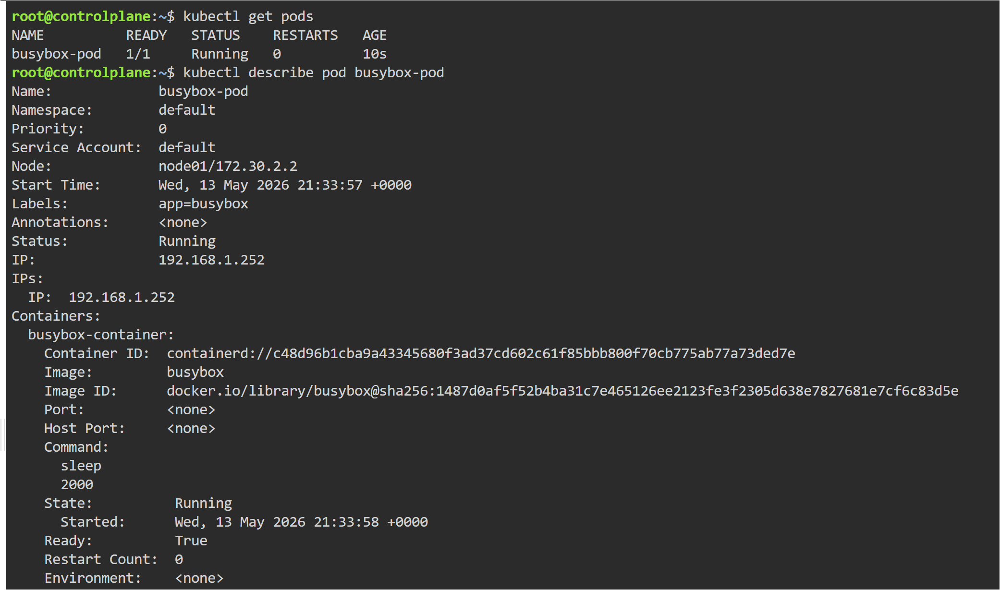
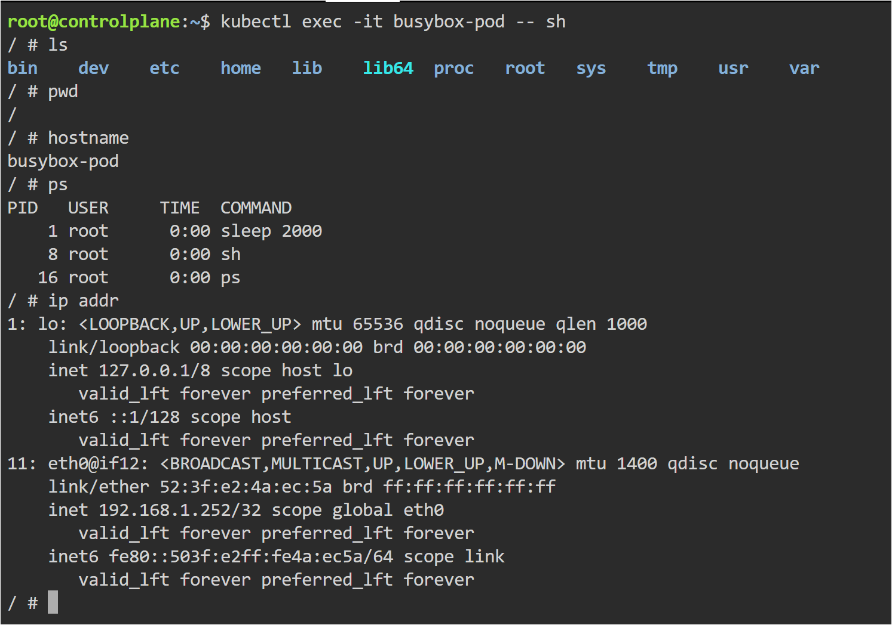

# Kubernetes Pods

## Objective
Learn how to create and manage Pods in Kubernetes.

---

## Topics Covered

- Pod Creation
- Pod Logs
- Pod Inspection
- Container Access using kubectl exec
- Nginx Default Files

## Pod Created
- nginx-pod

---

## YAML File
- yaml/nginx-pod.yaml

---

## Commands Used

```bash
kubectl apply -f nginx-pod.yaml

kubectl get pods

kubectl describe pod nginx-pod

kubectl logs nginx-pod

kubectl exec -it nginx-pod -- /bin/bash
```

---

## Pod Running


---

## Executing Inside Container


---

## Key Learning

- Pods are the smallest deployable units in Kubernetes
- Kubernetes automatically pulls container images
- kubectl exec allows entering running containers
- Nginx default files are stored inside /usr/share/nginx/html

## Real-World Use

Pods are used to run containerized applications in Kubernetes clusters. Engineers use kubectl exec and logs for debugging running containers in production environments.


---

# BusyBox Pod

## Objective

Learn how lightweight containers work in Kubernetes.

---

## Topics Covered

- BusyBox Container
- sleep Command
- Container Shell Access
- Container Exploration

---

## Pod Created

- busybox-pod

---

## YAML File

- yaml/busybox-pod.yaml

---

## Commands Used

```bash
kubectl apply -f busybox-pod.yaml

kubectl get pods

kubectl exec -it busybox-pod -- sh

kubectl logs busybox-pod

kubectl delete pod busybox-pod
```

---

## Pod Running



---

## Executing Inside BusyBox Container



---

## Key Learning

- Containers stop when the main process exits
- sleep command keeps containers alive
- BusyBox uses sh instead of bash
- Containers provide isolated runtime environments

---

## Real-World Use

BusyBox containers are commonly used for debugging, testing connectivity, checking DNS resolution, and troubleshooting Kubernetes networking issues.
