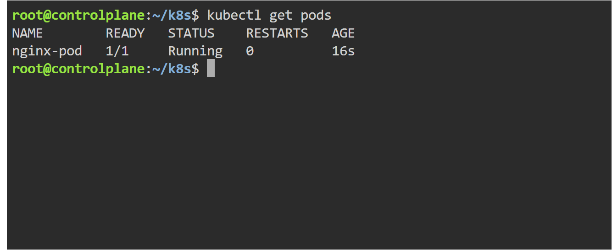
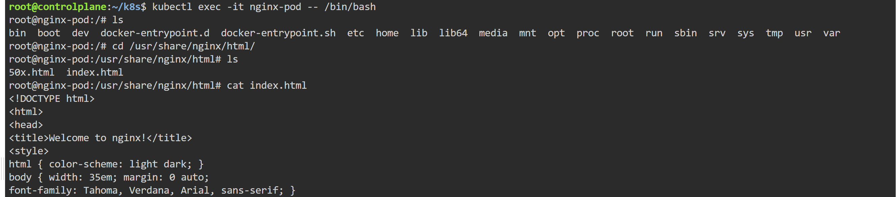

# Kubernetes Pods

## Objective
Learn how to create and manage Pods in Kubernetes.

---

## Topics Covered

- Pod Creation
- Pod Logs
- Pod Inspection
- Container Access using kubectl exec
- Nginx Default Files

## Pod Created
- nginx-pod

---

## YAML File
- yaml/nginx-pod.yaml

---

## Commands Used

```bash
kubectl apply -f nginx-pod.yaml

kubectl get pods

kubectl describe pod nginx-pod

kubectl logs nginx-pod

kubectl exec -it nginx-pod -- /bin/bash
```

---

## Pod Running



---

## Executing Inside Container



---

## Key Learning

- Pods are the smallest deployable units in Kubernetes
- Kubernetes automatically pulls container images
- kubectl exec allows entering running containers
- Nginx default files are stored inside /usr/share/nginx/html
