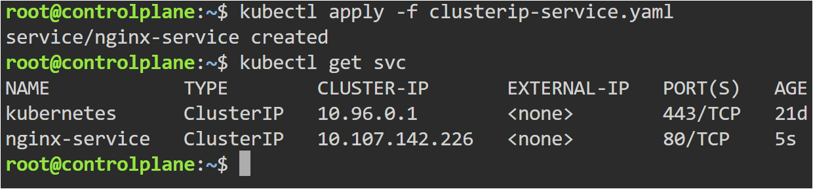
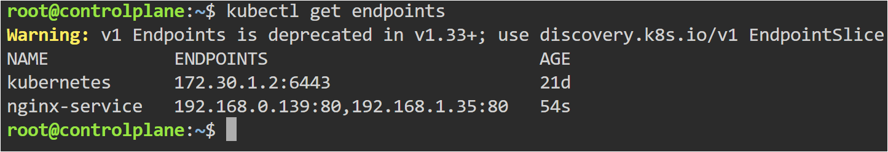
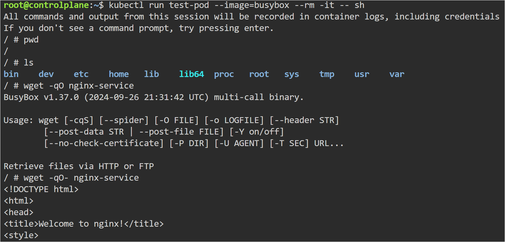
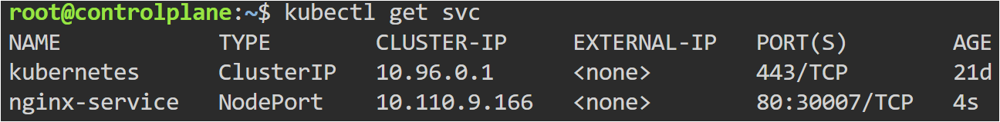
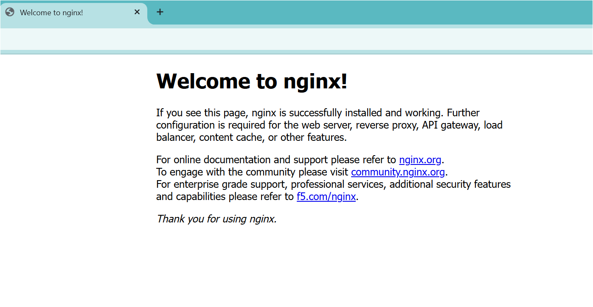

# Kubernetes Services

## Objective

Learn how Kubernetes Services provide stable networking, internal communication, external access, and traffic routing between applications.

---

## Topics Covered

- ClusterIP Service
- NodePort Service
- Labels and Selectors
- Endpoints
- Kubernetes DNS
- Service-to-Pod Communication
- Internal vs External Access
- targetPort Troubleshooting

---

## YAML Files

- yaml/nginx-deployment.yaml
- yaml/clusterip-service.yaml
- yaml/nodeport-service.yaml

---

## Commands Used

```bash
kubectl apply -f nginx-deployment.yaml

kubectl apply -f clusterip-service.yaml

kubectl apply -f nodeport-service.yaml

kubectl get svc

kubectl get endpoints

kubectl describe svc nginx-service

kubectl run test-pod --image=busybox --rm -it -- sh
```

---

# ClusterIP Service

ClusterIP provides internal communication inside the Kubernetes cluster.

Applications communicate using Service names instead of Pod IP addresses.



---

# Service Endpoints

Endpoints show which Pods are connected to the Service using labels and selectors.



---

# Accessing Service using BusyBox

A temporary BusyBox Pod was used to test internal communication using Kubernetes DNS.

Command used:

```bash
wget -qO- nginx-service
```



---

# NodePort Service

NodePort exposes Kubernetes Services externally using the Node IP and a fixed port.

Traffic Flow:

Browser → NodePort → Service → Pod



---

# Accessing Application Externally

The Nginx application was accessed externally using NodePort.



---

# Wrong targetPort Troubleshooting

A Service was intentionally configured with an incorrect targetPort value.

Service Port:
```yaml
port: 80
```

Incorrect targetPort:
```yaml
targetPort: 8080
```

The container was actually listening on:
```yaml
containerPort: 80
```

This caused Service communication failure.

---

# targetPort Failure


---

# Fixed targetPort Configuration

After correcting the targetPort value, Service communication worked successfully.


---

# Service Describe Output


---

## Key Learning

- Services provide stable networking for Pods
- ClusterIP enables internal communication
- NodePort enables external access
- Services use labels and selectors to identify Pods
- Endpoints map Services to running Pods
- Kubernetes DNS allows communication using Service names
- targetPort must match the container's listening port

---

## Real-World Use

Kubernetes Services are used extensively in production environments for service discovery, internal networking, external application exposure, and load balancing between application Pods.
