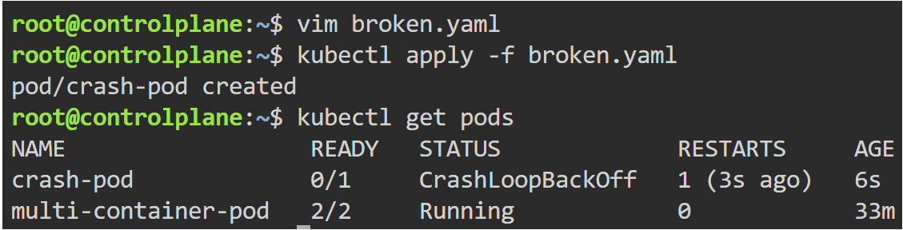
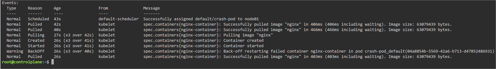
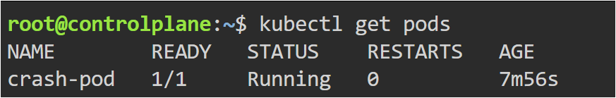
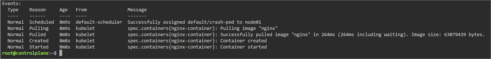

# CrashLoopBackOff Troubleshooting

## Objective

Learn how to identify and fix CrashLoopBackOff errors in Kubernetes.

---

## Problem

The container continuously crashed and restarted.

---

## Root Cause

The container executed:

```yaml
command: ["/bin/false"]
```

which exited immediately.

Kubernetes continuously restarted the failed container.

---

## Broken YAML

- broken.yaml

---

## Fixed YAML

- fixed.yaml

---

## Commands Used

```bash
kubectl apply -f broken.yaml

kubectl get pods

kubectl describe pod crash-pod

kubectl logs crash-pod

kubectl delete pod crash-pod

kubectl apply -f fixed.yaml
```

---

## CrashLoopBackOff Error



---

## Describe Output



---

## Fixed Pod Running



---

## Fixed Describe Output



---

## Key Learning

- CrashLoopBackOff is a restart loop
- Kubernetes restarts failed containers automatically
- kubectl describe is critical for troubleshooting
- Container lifecycle depends on the main running process

---

## Real-World Use

CrashLoopBackOff is one of the most common production Kubernetes issues. Engineers use logs, events, and describe output to identify failing applications and configuration issues.
