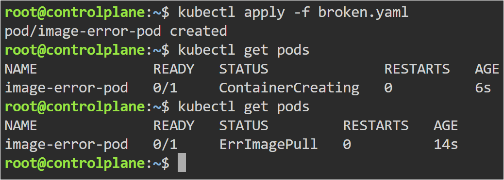
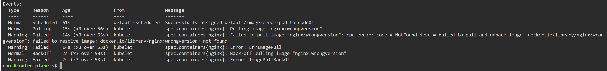
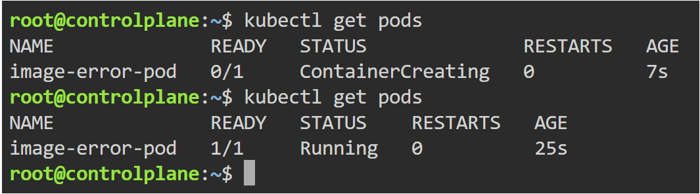

# ImagePullBackOff Troubleshooting

## Objective

Learn how to identify and fix ImagePullBackOff errors in Kubernetes.

---

## Problem

The container image could not be pulled successfully.

---

## Root Cause

The image tag:

```yaml
image: nginx:wrongversion
```

did not exist.

Kubernetes continuously retried pulling the image and entered ImagePullBackOff state.

---

## Broken YAML

- broken.yaml

---

## Fixed YAML

- fixed.yaml

---

## Commands Used

```bash
kubectl apply -f broken.yaml

kubectl get pods

kubectl describe pod image-error-pod

kubectl delete pod image-error-pod

kubectl apply -f fixed.yaml
```

---

## ImagePullBackOff Error



---

## Describe Output



---

## Fixed Pod Running



---

## Key Learning

- Kubernetes automatically pulls container images
- Incorrect image names or tags cause ImagePullBackOff
- kubectl describe provides detailed troubleshooting events
- Kubernetes retries failed image pulls automatically

---

## Real-World Use

ImagePullBackOff commonly occurs in production due to incorrect image tags, private registry authentication issues, or missing container images.
