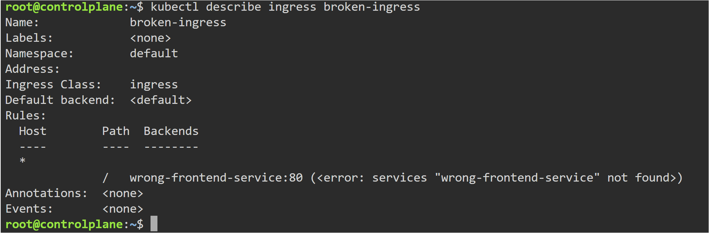
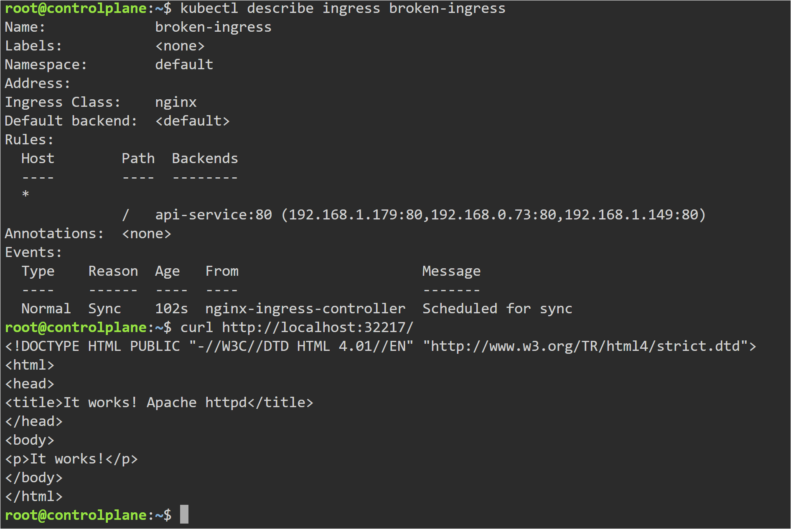
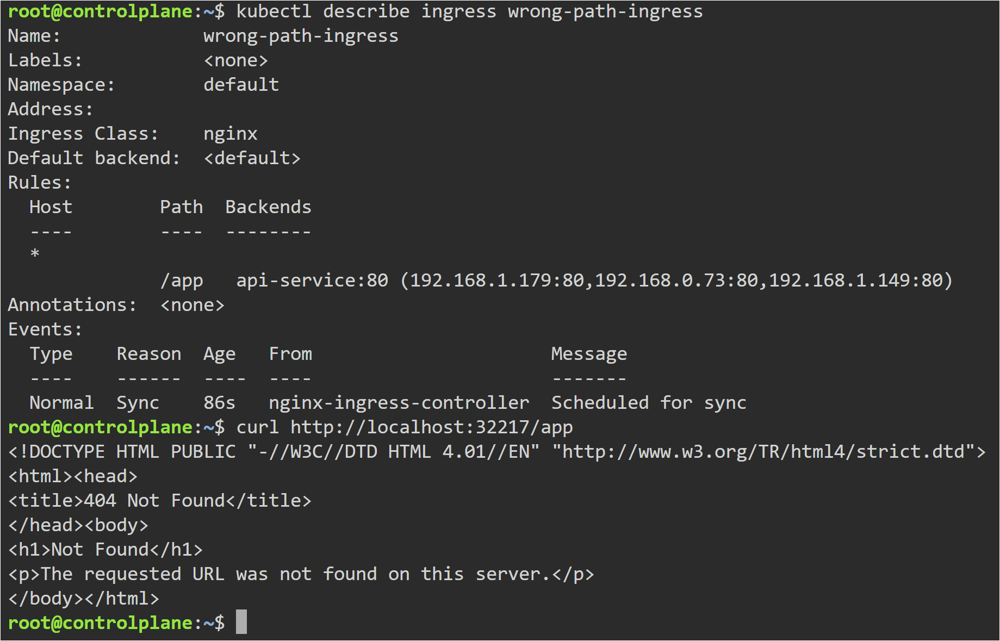
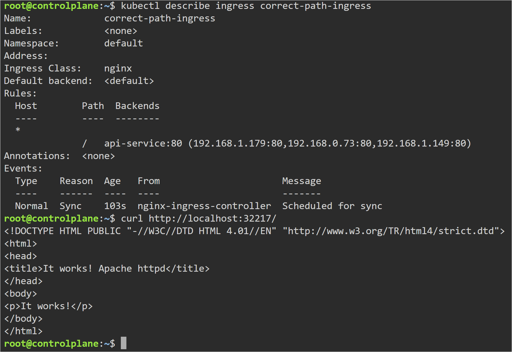
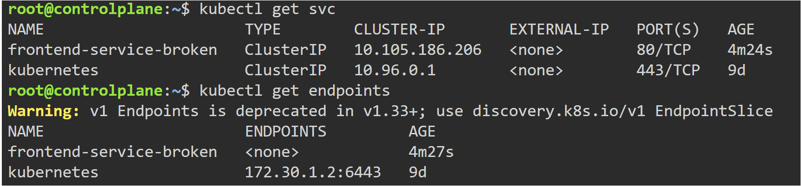
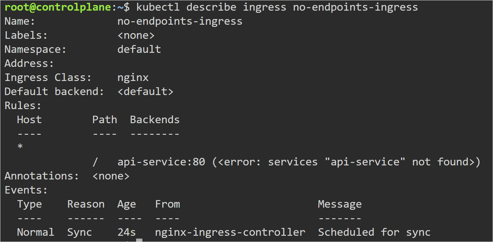
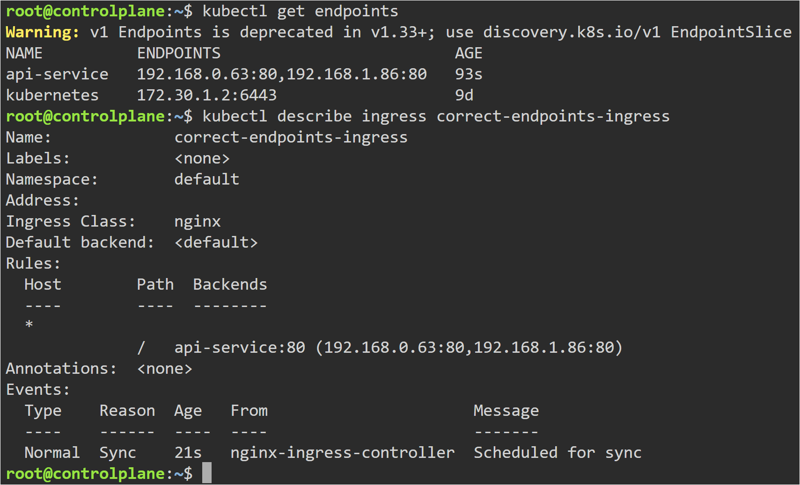

# Kubernetes Ingress Troubleshooting

## Objective

Learn how to troubleshoot common Kubernetes Ingress issues by intentionally breaking configurations, identifying the root cause, and applying the correct fix.

---

## Why Learn Ingress Troubleshooting?

In production, applications often become inaccessible not because Pods are unhealthy, but because traffic is not being routed correctly.

Understanding how to debug Ingress issues is an essential Kubernetes skill.

---

## Topics Covered

- Wrong Backend Service
- Wrong Path Configuration
- Service Without Endpoints
- kubectl describe ingress
- kubectl get endpoints
- Root Cause Analysis

---

# Lab 1 - Wrong Backend Service

## Problem

The Ingress resource referenced a Service that did not exist.

```yaml
service:
  name: wrong-frontend-service
```

As a result, the Ingress Controller could not forward traffic.

---

## Root Cause

The backend Service name configured inside the Ingress resource was incorrect.

Ingress Rules → ❌ Wrong Service → Traffic Failed

---

## Commands Used

```bash
kubectl apply -f yaml/broken-ingress-wrong-service.yaml

kubectl get ingress

kubectl describe ingress broken-ingress
```

---

## Browser Output


---

## Describe Output



---

## Solution

Updated the backend Service name to:

```yaml
service:
  name: frontend-service
```

Applied:

```bash
kubectl apply -f yaml/fixed-ingress.yaml
```

Verified routing successfully.

---

## Fixed Result



---

## Cleanup

```bash
kubectl delete ingress broken-ingress
```

---

# Lab 2 - Wrong Path Configuration

## Problem

Ingress was configured with:

```yaml
path: /app
```

but requests were sent to:

```
/frontend
```

Result:

404 Not Found

---

## Root Cause

The request path did not match the configured Ingress rule.

---

## Commands Used

```bash
kubectl apply -f yaml/broken-ingress-wrong-path.yaml

kubectl get ingress

kubectl describe ingress wrong-path-ingress
```

---

## Browser Error



---

## Correct Route

Accessing:

```
/app
```

successfully routed traffic.



---

## Cleanup

```bash
kubectl delete ingress wrong-path-ingress
```

---

# Lab 3 - Service Without Endpoints

## Problem

Ingress pointed to a Service that existed, but the Service selector did not match any Pods.

Service:

```yaml
selector:
  app: wrong-frontend
```

Result:

No Endpoints

---

## Root Cause

The Service selector did not match the Pod labels.

Ingress → Service → ❌ No Endpoints

---

## Commands Used

```bash
kubectl apply -f yaml/broken-service-no-endpoints.yaml

kubectl apply -f yaml/ingress-to-broken-service.yaml

kubectl get svc

kubectl get endpoints

kubectl describe ingress no-endpoints-ingress
```

---

## No Endpoints



---

## Describe Output



---

## Solution

Updated the Service selector:

```yaml
selector:
  app: frontend
```

Applied the corrected Service configuration.

---

## Fixed Result



---

## Cleanup

```bash
kubectl delete ingress no-endpoints-ingress

kubectl delete service frontend-service-broken
```

---

# Key Learning

- Ingress depends on healthy backend Services.
- A valid Ingress does not guarantee successful routing.
- Always verify:
  - Service names
  - Path rules
  - Endpoints
  - Pod labels
- `kubectl describe ingress` is one of the first commands to use when debugging Ingress issues.
- `kubectl get endpoints` helps verify whether a Service has healthy backend Pods.

---

# Troubleshooting Workflow

```
Application Not Working
        │
        ▼
Check Ingress
        │
        ▼
Check Service
        │
        ▼
Check Endpoints
        │
        ▼
Check Pod Labels
        │
        ▼
Identify Root Cause
        │
        ▼
Apply Fix
```

---

# Real-World Use

Ingress issues are among the most common Kubernetes networking problems in production environments. Engineers frequently troubleshoot incorrect backend services, path mismatches, missing endpoints, and routing failures using `kubectl describe`, Services, and Endpoints before investigating application-level issues.
