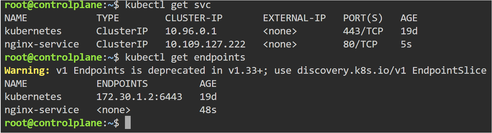
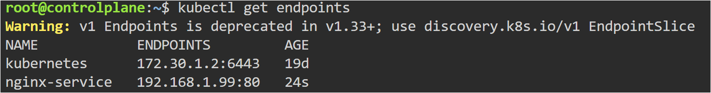

# Service Selector Mismatch Troubleshooting

## Objective

Learn how Kubernetes Services use labels and selectors to route traffic to Pods.

---

## Problem

The Service was unable to route traffic to the Pod.

---

## Root Cause

The Service selector:

```yaml
app: wrong
```

did not match the Pod label:

```yaml
app: nginx
```

As a result, Kubernetes could not create endpoints for the Service.

---

## Files Used

- pod.yaml
- broken-service.yaml
- fixed-service.yaml

---

## Commands Used

```bash
kubectl apply -f pod.yaml

kubectl apply -f broken-service.yaml

kubectl get svc

kubectl get endpoints

kubectl delete svc nginx-service

kubectl apply -f fixed-service.yaml
```

---

## Service Without Endpoints



---

## Fixed Service Endpoints



---

## Key Learning

- Services use selectors to identify Pods
- Labels and selectors must match correctly
- Services create endpoints for matched Pods
- Empty endpoints usually indicate selector mismatch

---

## Real-World Use

Selector mismatch is one of the most common Kubernetes networking issues. Engineers frequently troubleshoot Services by checking labels, selectors, and endpoints.
