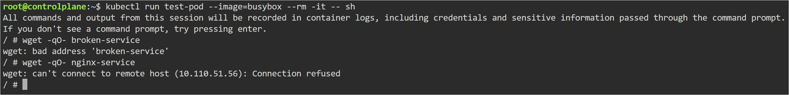
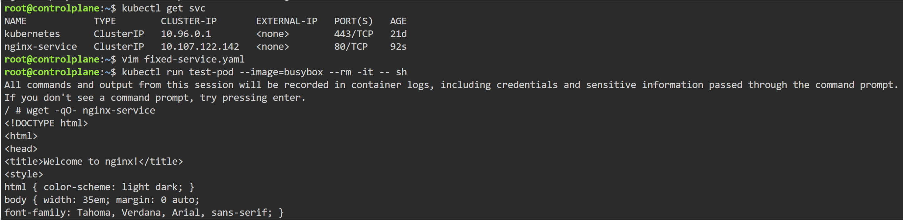
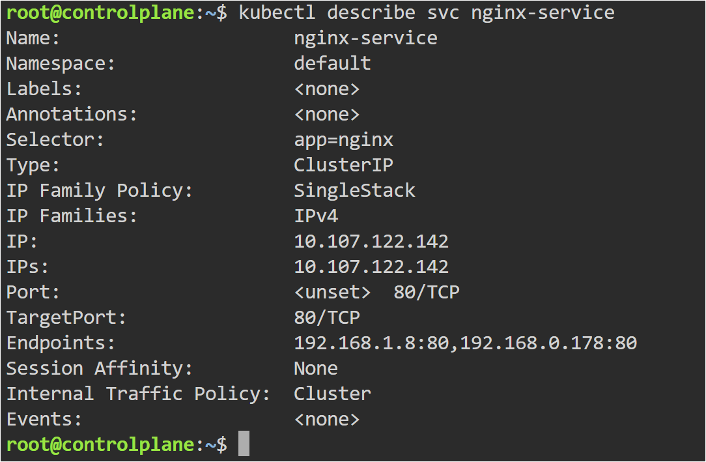

# Wrong targetPort Troubleshooting

## Objective

Learn how incorrect targetPort configuration can break Kubernetes Service communication.

---

## Problem

The Kubernetes Service was created successfully, but the application was not accessible.

---

## Root Cause

The Service was forwarding traffic to:

```yaml
targetPort: 8080
```

However, the Nginx container was listening on:

```yaml
containerPort: 80
```

This mismatch caused the Service communication failure.

---

## Files Used

- deployment.yaml
- broken-service.yaml
- fixed-service.yaml

---

## Commands Used

```bash
kubectl apply -f deployment.yaml

kubectl apply -f broken-service.yaml

kubectl get svc

kubectl get endpoints

kubectl describe svc nginx-service

kubectl run test-pod --image=busybox --rm -it -- sh
```

---

# targetPort Failure

The Service existed and endpoints were created, but traffic could not reach the container because the wrong targetPort was configured.



---

# Fixed targetPort Configuration

After correcting the targetPort value from 8080 to 80, Service communication started working successfully.



---

# Service Describe Output

The describe output helped identify the incorrect targetPort configuration.



---

## Key Learning

- Service port and targetPort are different concepts
- targetPort must match the container’s listening port
- Services can exist even when applications are unreachable
- Endpoints only verify Pod matching, not application connectivity
- kubectl describe is very useful for networking troubleshooting

---

## Real-World Use

Wrong targetPort configuration is a common Kubernetes networking issue in production environments. Engineers troubleshoot such issues using Services, endpoints, describe output, and connectivity testing.
